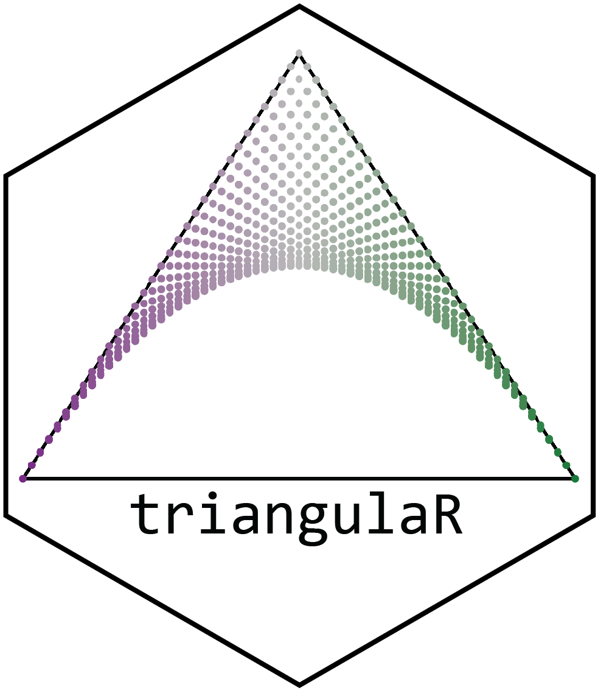
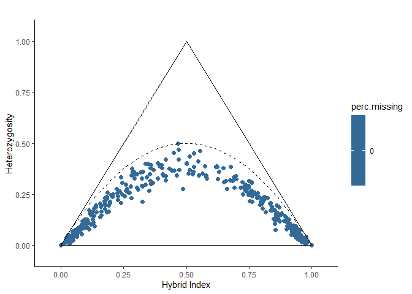

<!-- README.md is generated from README.Rmd. Please edit that file -->

# triangulaR 

<!-- badges: start -->

<!-- badges: end -->

*triangulaR* is a package for identifying ancestry-informative markers
(AIMS), calculating hybrid indices, interclass heterozygosity, and
building triangle plots. Check out the articles at the [package
website](https://omys-omics.github.io/triangulaR/articles/explore_triangle_plots.html)
for background on triangle plots, or stay here for a quick start on how
to use the package.

## Installation

You can install the development version of *triangulaR* from
[GitHub](https://github.com/omys-omics/triangulaR) with:

``` r
# install.packages("devtools")
devtools::install_github("omys-omics/triangulaR")
```

## Citation

If you publish any work that uses *triangulaR*, please consider citing
the following paper (currently available as a preprint):
<https://www.biorxiv.org/content/10.1101/2024.03.28.587167v1>

## How to use this package:

*triangulaR* builds on the functionality of
[vcfR](https://knausb.github.io/vcfR_documentation/) to analyze SNP data
in R. The first step is to read in the data from a vcf file.

#### Step 1: Read in data

It is expected that the data have already filtered for quality
(e.g. setting genotype quality and depth thresholds, removing
individuals and sites with high missing data, etc.). For help with this
step, see [SNPfiltR](https://github.com/DevonDeRaad/SNPfiltR).

``` r
library(triangulaR)
#> Loading required package: ggplot2
#> Warning: package 'ggplot2' was built under R version 4.0.5
#> This is triangulaR v.0.0.0.9000
#> 
#>           /\
#>          /  \
#>         /    \
#>        /______\
#> 
#> Usage information is available at: https://github.com/omys-omics/triangulaR/ 
#> 
#> Please cite the following if you use triangulaR in a publication:
library(vcfR)
#> 
#>    *****       ***   vcfR   ***       *****
#>    This is vcfR 1.14.0 
#>      browseVignettes('vcfR') # Documentation
#>      citation('vcfR') # Citation
#>    *****       *****      *****       *****

# Read in data
data <- read.vcfR("../SecondaryContact/gen.19000.vcf", verbose = F)
data
#> ***** Object of Class vcfR *****
#> 420 samples
#> 1 CHROMs
#> 1,788 variants
#> Object size: 6.2 Mb
#> 0 percent missing data
#> *****        *****         *****

# Or, use example vcfR object
example.vcfR
#> ***** Object of Class vcfR *****
#> 120 samples
#> 1 CHROMs
#> 6,177 variants
#> Object size: 7.1 Mb
#> 0 percent missing data
#> *****        *****         *****
```

#### Step 2: Make a popmap

A popmap is a data.frame with two columns labeled “id” and “pop”. Each
name of each sample in the vcfR object should be included in the “id”
column. All individuals in the vcfR object should be included in the
popmap, and vice versa. Each individual needs to be assigned to a
population. Every individual must be assigned to a population, and there
can be any number of populations. IDs and pops should be character
strings.

``` r
# Here is an example of what a popmap should look like
print(head(example.popmap))
#>     id pop
#> 1  i55  P1
#> 2 i159  P1
#> 3 i245  P1
#> 4 i246  P1
#> 5 i264  P1
#> 6 i526  P1
print(tail(example.popmap))
#>         id pop
#> 115 bc2.15 BC2
#> 116 bc2.16 BC2
#> 117 bc2.17 BC2
#> 118 bc2.18 BC2
#> 119 bc2.19 BC2
#> 120 bc2.20 BC2
```

#### Step 3: Choose sites above an allele frequency difference threshold

Theoretically, the hybrid index of an individual represents the
proportion of ancestry received from each parental population. In
practice, one way to calculate hybrid indices is by identifying loci
with allele frequency differences above a chosen threshold in the
parental populations and scoring individuals by allele counts at those
loci. There is a balance between using a small amount of highly
diagnostic site (e.g. fixed differences) and a large amount of less
diagnostic sites. I recommend trying difference values for the allele
frequency difference threshold to see how this value affects results.

``` r
# Create a new vcfR object composed only of sites above the given allele frequency difference threshold
example.vcfR.diff <- alleleFreqDiff(vcfR = example.vcfR, pm = example.popmap, p1 = "P1", p2 = "P2", difference = 0.9)
#> [1] "50 sites passed allele frequency difference threshold"
```

#### Step 4: Calculate hybrid index and heterozygosity for each sample

Once sites above the allele frequency difference threshold have been
identified, hybrid index and heterozygosity for each sample can be
calculated.

``` r
# Calculate hybrid index and heterozygosity for each sample. Values are returned in a data.frame
hi.het <- hybridIndex(vcfR = example.vcfR.diff, pm = example.popmap, p1 = "P1", p2 = "P2")
#> [1] "calculating hybrid indices and heterozygosities based on 50 sites"
```

#### Step 5: Visualize results as a triangle plot

``` r
# Generate colors (or leave blank to use default)
cols <- c("#af8dc3", "#7fbf7b", "#bababa", "#878787", "#762a83", "#1b7837")
# View triangle plot
triangle.plot(hi.het, colors = cols)
```


#### Step 6: Color triangle plot by missing data

The data.frame returned by the hybridIndex function also contains the
percent of missing data in each individual. View the triangle plot with
samples colored by percent missing data to investigate its effect.

``` r
# There is no missing data in this dataset, so all samples have the same color
missing.plot(hi.het)
```


