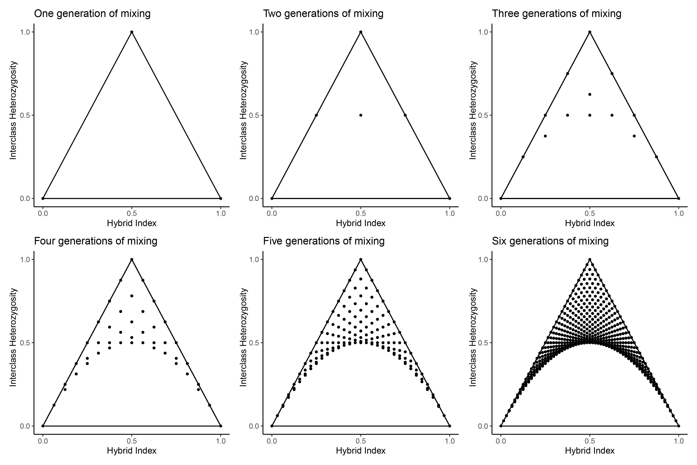

```{r setup, include=FALSE}
knitr::opts_chunk$set(echo = TRUE)
```
## new

# Introduction

### Punnet Squares

### Hardy-Weinberg Equilibrium

Let's consider the hybrid index and interclass heterozygosity of individuals at sites that are fixed for alternate alelles in the parental populations. When only considering fixed differences, it follows that hybrid index equates to the frequency of p1 alleles across the genome. Similarly, interclass heterozygosity equates to the frequency of p1p2 genotypes across the genomes.

Based on the above formulas, we can calculate the hybrid index and interclass heterozygosity of any offspring given only the average allele frequency of p1 alleles in the parents. 




### Try it out


Example with simulated data:
1. See distribution of allele frequency differences
2. Get names of AIMs
3. Try multiple thresholds and get vcfRs
4. Calculate HI and HET
5. Compare triangle plots


</style>

<div class="shiny-app-frame"> 
<iframe src="https://omys-omics.shinyapps.io/Hybrid_Offspring/" width="1000" height="1000">
</iframe>
</div>


Example with real data:
1. See distribution of allele frequency differences
2. Try multiple thresholds and get vcfRs
3. Calculate HI and HET
4. Compare triangle plots
5. Color by missing data

### Try changing parameters to see how they impact hybrid identification


</style>

<div class="shiny-app-frame"> 
<iframe src="https://omys-omics.shinyapps.io/Simulate_hybrid_parameters/" width="1000" height="1200">
</iframe>
</div>


