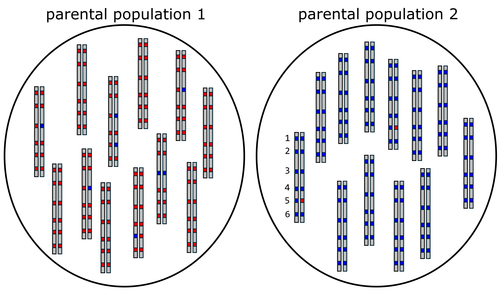
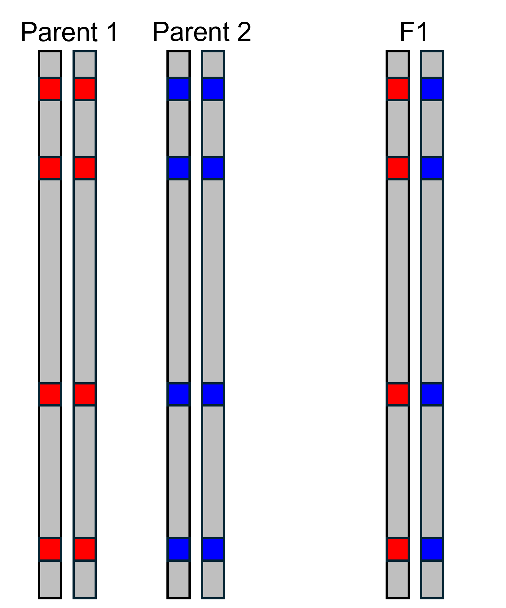
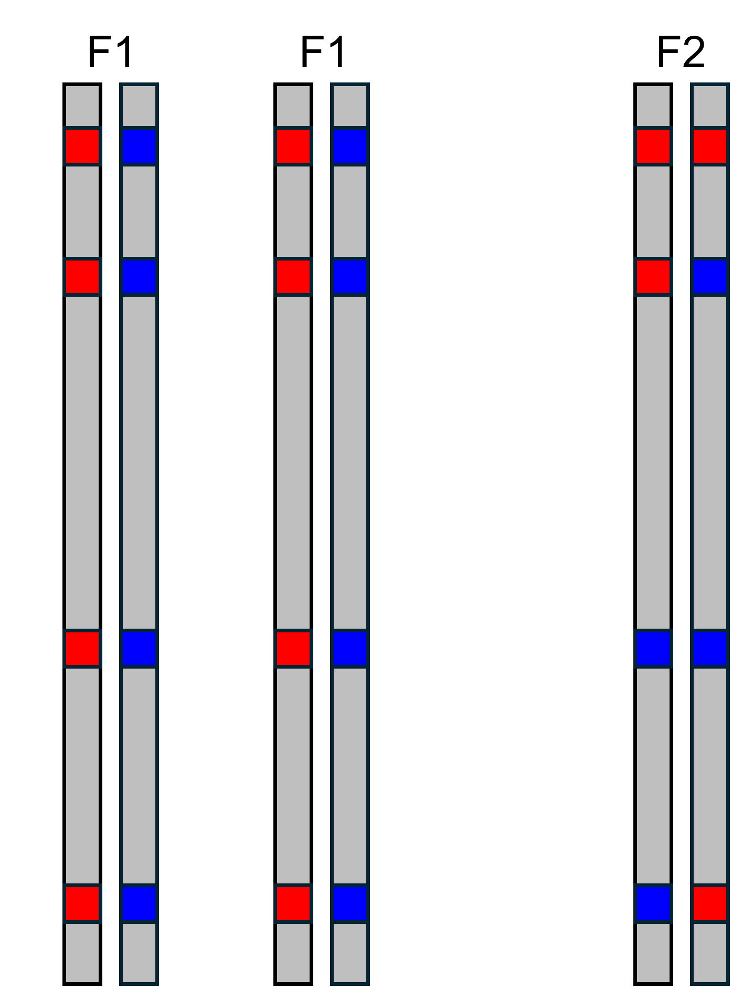
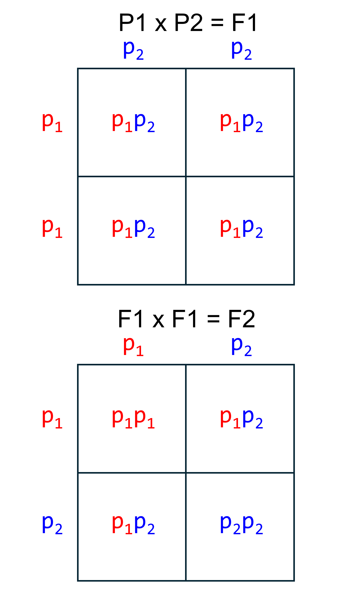
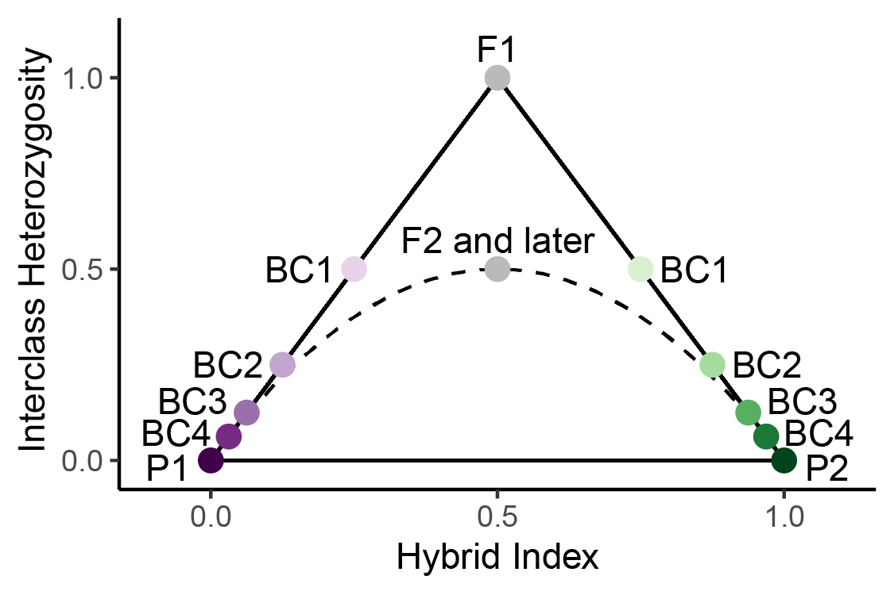
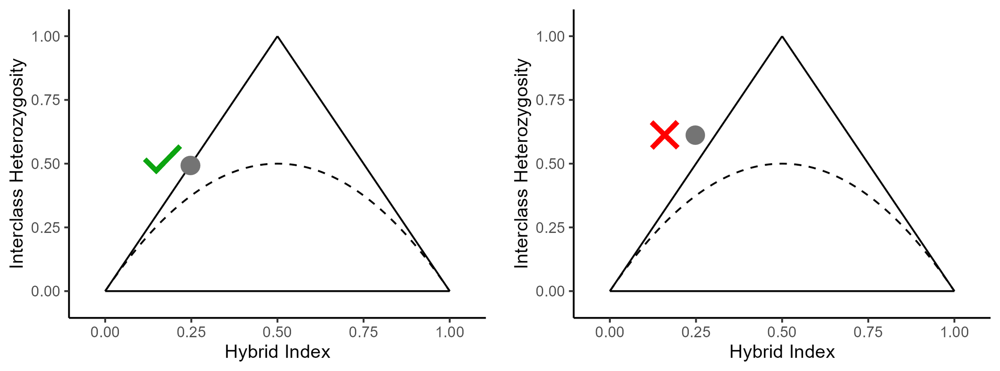

```{r setup, include=FALSE}
knitr::opts_chunk$set(echo = TRUE)
```

### Identifying AIMs

In order to build triangle plots, the first thing we need to do is identify ancestry-informative markers (AIMs). These are SNPs that have alleles that are sorted between two distinct parental groups, which means that each allele at a SNP indicates ancestry from one parental group or the other. In this example, we are going to assume that there are only two alleles at each SNP, which is also how empircal datasets are often treated. Consider the two populations shown below. Each population consists of diploid organisms, and six SNPs are shown on the example chromosomes. We can see that population 1 only has red alleles at SNPs 1, 2, 4, and 6, and that there are some blue alleles at SNPs 3 and 5. If we look at population 2, we see that there are only blue alleles at SNPs 1, 2, 3, 4, and 6. So, both populations have both alleles at site 5, and population 1 has both alleles at site 3. Therefore, only sites 1, 2, 4, and 6 are completely informative ancestry. When alleles at a SNP are completely sorted between populations, we call this a fixed difference. Moving forward in this example, we will use SNPs 1, 2, 4, and 6 as AIMs.


$$\\[0.05in]$$


### Calculating Hybrid Index and Interclass Heterozygosity


 One thing triangle plots can help do is identify early generation hybrids, such as F1s. An F1 is the offspring of a cross between an individual from parental population 1 and parental population 2. The illustration to the left shows the alleles present at the AIMs we have identified. Because offspring inherit one allele from each parent, we can see that the F1 has a blue allele and a red allele at each AIM. In order to build a triangle plot, we first need to calculate hybrid index and interclass heterozygosity. Hybrid index is calculated by counting the number of alleles inherited from parental population 2, and dividing by the total number of alleles. This gives us a value that can range between 0 and 1. In this case, the F1 has four alleles from parental population 2 (blue), and eight total alleles. This gives a hybrid index of $\frac{4}{8}=0.5$. Interclass heterozygosity is calculated by counting the number of AIMs that have an allele from both parental populations, and dividing by total number of AIMs. In this case there are four AIMs that have an allele from both parental populations, and four total AIMs, meaning the interclass heterozygosity is $\frac{4}{4}=1$.


 Let's consider another type of cross. The illustration to the left shows the offspring of a cross between two F1s, called an F2. We can calculate hybrid index and interclass heterozygosity for the F2 manually as we did above. In the F2, we see there are four alleles from parental population 2 (blue), so hybrid index is $\frac{4}{8}=0.5$. In contrast to the F1 though, the F2 only has two AIMs with alleles from both parental populations, so interclass heterozygosity is $\frac{2}{4}=0.5$. These are the expected values for an F2, as we will see in the next section.
$$\\[0.1in]$$

### Punnett Squares  


Another way to think about the expected genotypes in hybrid offspring is with Punnett squares. The Punnett square on the top shows the possible genotypes at an AIM in an F1. Because the parents are homozygous for different alleles, the only possible genotype is $p_{12}$. Since the parents have the same genotype at all AIMs, F1s will have the $p_{12}$ genotype at all AIMs.

Now let's look at a Punnett square for a cross between two F1s. We see that for any given AIM, there are three possible genotypes in an F2. There is a 25% chance of the $p_{11}$ genotype, a 50% chance of the $p_{12}$ genotype, and a 25% chance of the $p_{22}$ genotype. At any given AIM, the F2 can only have one genotype, but if we had a dataset of 100 AIMs, we would expect that 25 would display the $p_{11}$ genotype, 50 would display the $p_{12}$ genotype, and 25 would display $p_{22}$ genotype.


### Borders of a Triangle Plot
 So, after seeing how hybrid index and interclass heterozygosity are calculated, let's see where individuals appear on a triangle plot. On the plot to the left, we can see that F1s and F2s both have a hybrid index of 0.5, but can be distinguished because F1s have an interclass heterozygosity of 1. BC on the plot stands for "backcross". A backcross is when a hybrid crosses with parental individual. BC1 indicates the offspring of a cross between an F1 and a member of parental population 1 (P1). BC2 indicates a cross between BC1 and P1, and so forth. The solid black lines forming a triangle indicate the possible space on the plot. All individuals must be either on the lines or within the triangle. This is because hybrid index and interclass heterozygosity are not fully independent of each other. To see why, let's consider the example below. 




The triangle plots above show an invalid (left) and valid (right) combination of hybrid index and interclass heterozygosity. Let's say we used 100 AIMs to calculate hybrid index and interclass heterozygosity. To see why the gray point with the red X next to it is not possible, let's consider the implications of its interclass heterozygosity. An interclass heterozygosity of 0.6 means that of the 100 AIMs, 60 of them are heterozygous, or have a genotype of $p_{12}$. So, we know there are a minimum of 30 $p_2$ alleles. Thus, even if the genotype at every other AIM is $p_{11}$, there are still 30 $p_2$ alleles, meaning the hybrid index is $\frac{30}{100}=0.3$. So, the combination of a hybrid index of 0.25 and interclass heterozygosity of 0.6 is impossible, because a hybrid index of 0.25 means there can be at most 25 $p_2$ alleles but an interclass heterozygosity of 0.6 means there must be at least 30 $p_2$ alleles.


