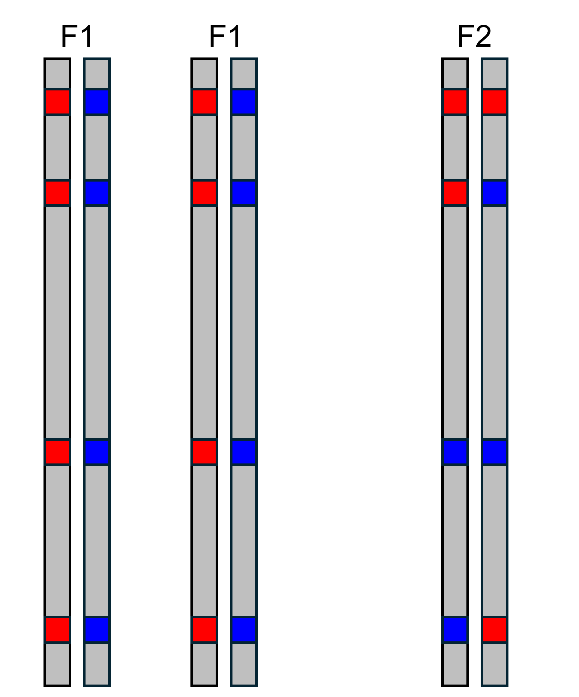

```{r setup, include=FALSE}
knitr::opts_chunk$set(echo = TRUE)
```

### Identifying AIMs

In order to build triangle plots, the first thing we need to do is identify ancestry-informative markers (AIMs). These are SNPs that have alleles that are sorted between two distinct parental groups, which means that each allele at a SNP indicates ancestry from one parental group or the other. In this example, we are going to assume that there are only two alleles at each SNP, which is also how empircal datasets are often treated. Consider the two populations shown below. Each population consists of diploid organisms, and six SNPs are shown on the example chromosomes. We can see that population 1 only has red alleles at SNPs 1, 2, 4, and 6, and that there are some blue alleles at SNPs 3 and 5. If we look at population 2, we see that there are only blue alleles at SNPs 1, 2, 3, 4, and 6. So, both populations have both alleles at site 5, and population 1 has both alleles at site 3. Therefore, only sites 1, 2, 4, and 6 are completely informative ancestry. When alleles at a SNP are completely sorted between populations, we call this a fixed difference. Moving forward in this example, we will use SNPs 1, 2, 4, and 6 as AIMs.


### Calculating Hybrid Index and Interclass Heterozygosity


 words words asdfjklasdjfklas wofds ofkdwwo wrods words words words asdfjklasdjfklas wofds ofkdwwo wrods words words words asdfjklasdjfklas wofds ofkdwwo wrods words words words asdfjklasdjfklas wofds ofkdwwo wrods words words words asdfjklasdjfklas wofds ofkdwwo wrods words words words asdfjklasdjfklas wofds ofkdwwo wrods words words words asdfjklasdjfklas wofds ofkdwwo wrods words words words asdfjklasdjfklas wofds ofkdwwo wrods words words words asdfjklasdjfklas wofds ofkdwwo wrods words words words asdfjklasdjfklas wofds ofkdwwo wrods words words words asdfjklasdjfklas wofds ofkdwwo wrods words words words asdfjklasdjfklas wofds ofkdwwo wrods words words words asdfjklasdjfklas wofds ofkdwwo wrods words words words asdfjklasdjfklas wofds ofkdwwo wrods words words words asdfjklasdjfklas wofds ofkdwwo wrods words words words asdfjklasdjfklas wofds ofkdwwo wrods words words words asdfjklasdjfklas wofds ofkdwwo wrods words words words asdfjklasdjfklas wofds ofkdwwo wrods words 

222222222222222222222222222222222222222222222222222222222222222222222222222222222222222222222222222222222222222222222222222222222222222222222222222222222222222222222222222222222222222222222222222222222222222222222222222222222222222222222222222222222222222222222222222222222222222222222222222222222222222222222222222222222222222222222222222222222222222222222222222222222222222222222222222222222222222222222222222222222222222222222222222222222222222222222222222222222222222222222222222222222222222222222222222222222222222222222222222222222222222222222222222222222222222222222222222222222222222222222222222222222222222222222222222222
$$\\[0.1in]$$

{width=250}
$$\\[0.1in]$$

### Punnett Squares


### Borders of Triangle Plot
